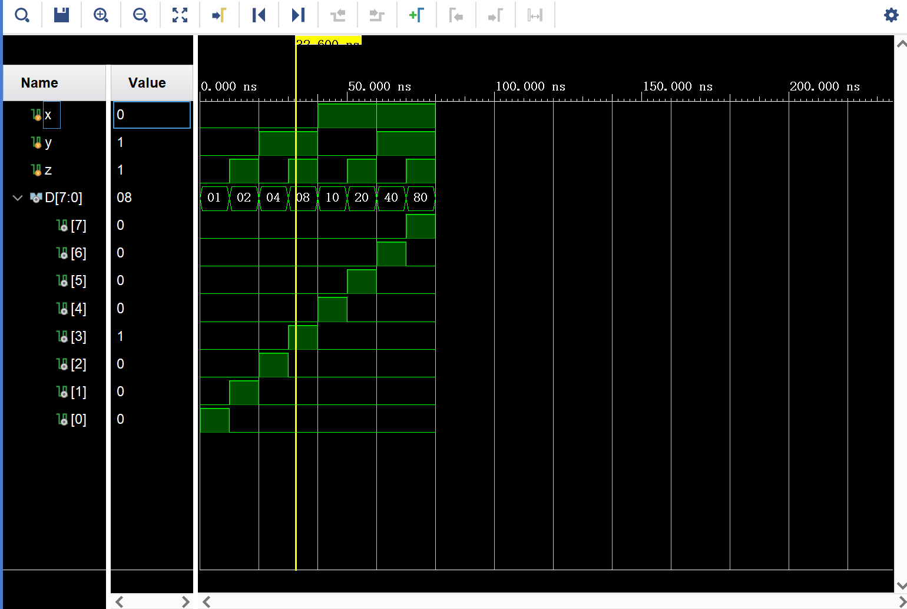
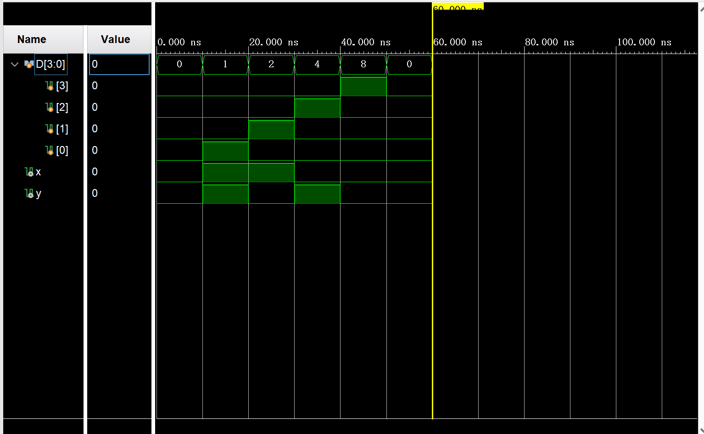

# Lab_1_2 4-2 编码器

### 实验目的

该实验需要完成以下两个目标：

根据教材4－9节，设计3－8译码器 
    1．写出3－8译码器真值表，通过化简写出译码器布尔表达式 
    2．使用Verilog HDL实现，用vivado仿真并下载到实验板进行验证 
输入使用板上的switch拨段开关，输出使用板上的led灯。


根据教材4－10节，设计4－2编码器 
    1．写出4－2编码器真值表，通过化简写出编码器布尔表达式 
    2．画出原理图，仿真并下载到实验板进行验证  
输入使用板上的switch拨段开关，输出使用板上的led灯。 

同时，需要学习verilog语言以及vivado工具的使用，为后续学习打基础


该实验需要完成上述所有要求
### 实验内容
使用vivado2019.2进行encoder  decoder开发，使用xc7a100tcsg324开发板测试，使用Verilog HDL进行开发，完成实验目的中给出的任务

### 实验步骤

### 1 得到真值表和逻辑表达式

#### 1.1.1 3-8译码器真值表如图所示

<table>
    <tr>
        <th colspan="3">Input</th>
        <th colspan="8" >Output</th>
    </tr>
    <tr>
        <td>x</td>
        <td>y</td>
        <td>z</td>
        <td>D_0</td>
        <td>D_1</td>
        <td>D_2</td>
        <td>D_3</td>
        <td>D_4</td>
        <td>D_5</td>
        <td>D_6</td>
        <td>D_7</td>
    <tr>
        <td>0</td>
        <td>0</td>
        <td>0</td>
        <td>1</td>
        <td>0</td>
        <td>0</td>
        <td>0</td>
        <td>0</td>
        <td>0</td>
        <td>0</td>
        <td>0</td>
    </tr>
    <tr>
        <td>0</td>
        <td>0</td>
        <td>1</td>
        <td>0</td>
        <td>1</td>
        <td>0</td>
        <td>0</td>
        <td>0</td>
        <td>0</td>
        <td>0</td>
        <td>0</td>
    </tr>
    <tr>
        <td>0</td>
        <td>1</td>
        <td>0</td>
        <td>0</td>
        <td>0</td>
        <td>1</td>
        <td>0</td>
        <td>0</td>
        <td>0</td>
        <td>0</td>
        <td>0</td>
    </tr>
    <tr>
        <td>0</td>
        <td>1</td>
        <td>1</td>
        <td>0</td>
        <td>0</td>
        <td>0</td>
        <td>1</td>
        <td>0</td>
        <td>0</td>
        <td>0</td>
        <td>0</td>
    </tr>
    <tr>
        <td>1</td>
        <td>0</td>
        <td>0</td>
        <td>0</td>
        <td>0</td>
        <td>0</td>
        <td>0</td>
        <td>1</td>
        <td>0</td>
        <td>0</td>
        <td>0</td>
    </tr>
    <tr>
        <td>1</td>
        <td>0</td>
        <td>1</td>
        <td>0</td>
        <td>0</td>
        <td>0</td>
        <td>0</td>
        <td>0</td>
        <td>1</td>
        <td>0</td>
        <td>0</td>
    </tr>
    <tr>
        <td>1</td>
        <td>1</td>
        <td>0</td>
        <td>0</td>
        <td>0</td>
        <td>0</td>
        <td>0</td>
        <td>0</td>
        <td>0</td>
        <td>1</td>
        <td>0</td>
    </tr>
    <tr>
        <td>1</td><td>1</td><td>1</td><td>0</td> <td>0</td><td>0</td><td>0</td><td>0</td><td>0</td><td>0</td><td>1</td>
    </tr>
    
</table>

#### 1.1.2 4-2编码器如图所示真值表

<table>
    <tr>
        <th colspan="4">Input</th>
        <th colspan="2" >Output</th>
    </tr>
    <tr>
        <td>D_0</td>
        <td>D_1</td>
        <td>D_2</td>
        <td>D_3</td>
        <td>x</td>
        <td>y</td>
    <tr>
        <td>1</td>
        <td>0</td>
        <td>0</td>
        <td>0</td>
        <td>0</td>
        <td>0</td>
    </tr>
    <tr>
        <td>0</td>
        <td>1</td>
        <td>0</td>
        <td>0</td>
        <td>0</td>
        <td>1</td>
    </tr>
    <tr>
        <td>0</td>
        <td>0</td>
        <td>1</td>
        <td>0</td>
        <td>1</td>
        <td>0</td>
    </tr>
    <tr>
        <td>0</td>
        <td>0</td>
        <td>0</td>
        <td>1</td>
        <td>1</td>
        <td>1</td>
    </tr>
</table>

#### 1.2.1 写出decoder逻辑表达式

##### 因为输出有8个且每次只有一种输出为真，直接观察就可以得到对应的逻辑表达式，即
D0 = (~x)&(~y)&(~z) 
D1 = (~x)&(~y)&(z)
D2 = (~x)&(y)&(~z)
D3 = (~x)&(y)&(z)
D4 = (x)&(~y)&(~z)
D5 = (x)&(~y)&(z) 
D6 = (x)&(y)&(~z)
D7 = (x)&(y)&(z)  

#### 1.2.2 写出encoder逻辑表达式

 
##### 观察图表，发现：
x在D_2或D_3为真时为真，y在D_1或D_3为真时为真
故逻辑表达式就是：
    x=D_2+D_3
    y=D_1+D_3


#### 1.3 分析问题

##### 1.3.1 decoder
decoder比较直白，直接按照之前分析的表达式即可得到结果

##### 1.3.2 encoder
在这个图表中，我们注意到输入只允许有一种为1，其他为0，否则时没有定义的。在实际实现中，必须要考虑多个1输入的情况

对此，可以实现一个优先策略，保证只读取一个有效的1。
查阅资料可知，casez可以使用?作为“可以匹配任意值”，适合这种情况
因此，选择优先匹配高位的1作为优先逻辑

#### encoder显示位
为了validate输入是否有效，可以增加一个有效位输入
直接在default部分将valid设置为0，其他时候设置为1即可
即体现出了一个有效位
#### 1.4 画出原理图(encoder)

因为要实现一个优先逻辑，需要额外的逻辑来处理
首先，x只和D_2 D_3有关，y只与D_1 D_3有关
D0-D3对应输入向量的1-4位，优先逻辑要求高位优先
因此，对于D0-D2,需要首先判断是否有高位的输入为1
对于D_2 逻辑为D_2 and not D_3
对于D_1 逻辑为D_1 and not D_2 D_1 and not D_3

#### 1.5 转化为Verilog描述

##### 代码(decoder)

```verilog

module encoder_4_2( 
    input wire [3:0]D,
    
    output reg x,
    output reg y,
    output reg valid 

);


always @(*) begin
    casez (D)
        4'b???1:begin
            x=1;
            y=1;
            valid=1;
        end
        4'b??10:begin
            x=1;
            y=0;
            valid=1;
        end
        4'b?100:begin
            x=0;
            y=1;
            valid=1;
        end
        4'b1000:begin
            x=0;
            y=0;
            valid=1;
        end
        default:begin
            x=0;
            y=0;
            valid=0;
        end
    endcase
end
endmodule


```

##### 以上是我使用到的代码，同样，优先编码器也可以只用逻辑运算实现(参考1.4)
对于输入1 2，输入2要先和输入3的非做与运算后参与后续运算，1要和2 3的非做运算后参与后续运算
这样实现的效果是和上述代码一样的。


#### 1.4 生成比特流并分别导入实验板上

### 实验结果（仿真图）

#### Decoder 仿真如下


#### Encoder仿真如下

注意这里的D[0:3]和我上面分析的是相反的，即D[3]才是我上述分析的D[0]


### 实验中遇到的问题：

#### 1 实验环境问题

本次实验第一部分中，因为不熟练，第一个部分最开始没有在project里选择合适的硬件，导致了无法生成比特流。之后重新开启一个项目时发现自己选错了硬件，最终解决这个问题。

#### 2 Verilog语法问题
本次实验第一部分中，，因为不熟悉verilog出现了一些语法的错误，自行根据报错查询书本和其他资料解决。

#### 3 优先级的考虑

本次实验第二部分中，因为输入的组合并不是全为有效组合，因此需要排除这些组合的影响。我选择的策略是给输入确定优先级。一开始，我想直接if-else，但考虑到课上的提醒，我决定采用casez的方法，并通过查阅资料得到使用?作为通配符来适配各个情况，解决了这个问题。

### 体会

作为第一个lab，其实现部分比较简洁，主要是熟悉vivado工具使用和verilog语法，同时能对encoder和decoder有一定的理解。

    