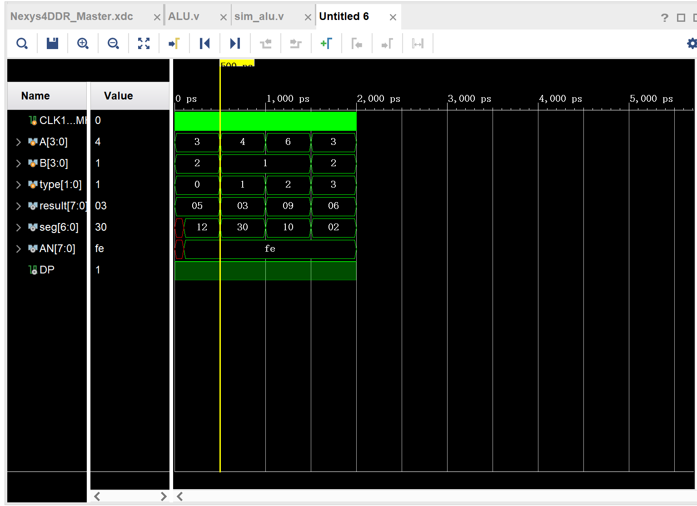

# Lab 2 ALU运算单元

## 实验目的
### 该实验需要实现一个简单的ALU运算单元，要求如下  
#### 输入信号：A B 
2组4位输入信号（A3-A0, B3～B0）,使用板上的switch拨段开关；   
#### 数据输出信号：F	  	
8位输出，使用板上的7段数码显示（每4bit一个数码管，16进制）；   
#### 功能控制信号：op	 	
2位控制信号（op1～op0），使用板上的switch拨段开关。 

要求实现加减取反乘四种基本运算，并显示到七段数码管上  

## 实验内容
使用vivado2019.2进行encoder  decoder开发，使用xc7a100tcsg324开发板测试，使用Verilog HDL进行开发，完成实验目的中给出的任务

## 实验设计思路

### 架构

ALU 最上层的组装器
|-----Adder 加法实现
|-----Subtractor 减法实现
|-----Negator 取反实现
|-----Multuplier 乘法实现
|-----HexTo7Segment 调用显示到两个数码

### 模块设计(不包含直接调用的数码管模块)

#### Adder
加法首先拓展到8位以支持显示进位，最高进位1
```verilog
module Adder(
    input [3:0] A,
    input [3:0] B,
    output [7:0] O
    );
    assign O={4'b0000,A}+{4'b0000,B};
endmodule
```
### Subtractor
减法对于借位采取的策略为：当被减数大于减数时，遵循无符号数的特性，选择让他进行下溢出，比如，1-2会显示FF即代表了溢出  
因此，为了实现这个逻辑，直接采取拓展到8位进行减法
```verilog
module Subtractor(
    input [3:0] A,
    input [3:0] B,
    output [7:0] O
    );
    assign O={4'b0000,A}-{4'b0000,B};
    
endmodule
```
### Negator
先进行取反，再拓展到8位支持显示
```verilog
module Negator(
    input [3:0] A,
    output [7:0] O
    );
    assign O={4'b0000,~A};
endmodule
```
### Multuplier
```verilog
四位乘四位结果最多为8位  
直接进行乘法即可满足需求
module Multiplier(
    input [3:0] A,
    input [3:0] B,
    output [7:0] O
    );
    assign O=A*B;
endmodule
```

### ALU 
```verilog
ALU模块组装前述所有的模块，并实现最后的功能
它包括输入A、B、type(代表数字A、B和输入类型type)
在其中实例化前面的模块
输出用于七段数码管使用的信号并调用对应模块进行显示

module ALU(
    input CLK100MHZ, 
    input [3:0] A,
    input [3:0] B,
    input [1:0] type,
    output [6:0] seg, 
    output [7:0] AN ,
    output DP,
    output reg [7:0] result
    );
    
    
    wire [7:0] add_result;
    wire [7:0] subtract_result;
    wire [7:0] negative_result;
    wire [7:0] multiply_result;

    Adder add_instance (.A(A),.B(B),.O(add_result));
    Subtractor subtract_instance (.A(A),.B(B),.O(subtract_result));
    Negator negative_instance (.A(A),.O(negative_result));
    Multiplier multiply_instance (.A(A),.B(B),.O(multiply_result));

    always @(*) begin
        case(type)
            2'b00:result=add_result;
            2'b01:result=subtract_result;
            2'b10:result=negative_result;
            2'b11:result=multiply_result;
        endcase
    end

   HexTo7Segment display (
        .CLK100MHZ(CLK100MHZ), 
        .result(result), 
        .AN(AN), 
        .seg(seg), 
        .DP(DP)
   
   );
endmodule
```

## 设计流程

### 1 确定架构
确定使用的模块包括一个ALU的顶层模块，四个对应的计算模块以及一个外部的七段数码管显示模块，组装实现需要的功能

### 2 确定计算模块的设计
根据要求实现的效果，分别涉及四个模块的实现方式，即通过扩展到八位进行加减，正常乘法以及先取反后扩展到八位  

### 3 编写verilog代码实现计算模块

### 4 边写Verilog代码实现alu模块，在其中组装计算模块并连接显示模块

### 5 进行仿真以及实现，最后在开发板上测试效果
边写模拟用代码并测试代码是否符合预期情况，然后生成实现并修改约束文件，生成比特流，导入开发板进行测试。

## 仿真结果

其中，因为电路有一定的延迟，因此seg[6:0]最开始是没有确定的值的  
可以看到，四种运算都符合预期的结果，通过仿真实验，确定了代码本身的功能是正确的    
## 实验过程中遇到的问题

### 1 架构设计
架构设计阶段缺乏经验，我选择按照之前写更高层软件的习惯对功能进行模块化，最终设计上述架构
### 2 输入输出设计
在设计输入的时候，因为不熟悉verilog以及七段数码管显示，一开始创建了大量不符合要求的output wire,后来对其进行了全部删除的处理 
### 3 七段数码管显示
七段数码管显示虽然提供了示例代码，但是因为这次试验要求两个数码管显示，因此需要对代码进行一系列修改   
同时，数码管显示涉及到时序电路，而在之前并没有相关经验，因此修改数码管部分使其能够使用花费了较多时间。最后，代码使用分频器来降低时钟频率切换显示result的高低四位，从而让数码管能实现更好的显示
最后，参考ppt以及网上的实现，将数码管功能正确实现   
### 4 约束文件设计
新的约束文件内容较多，花费了一定时间确定哪些是需要我进行修改的端口
### 5 编写模拟
本次实验中给，在simulation过程中出现了reg类型被无意间多个位置赋值导致了错误。这是因为verilog代码内并不是顺序执行的，非net类型不能并发的赋值。最后改为了wire从而仅用于追踪result变化


## 总结
本次实验实现了一个简单的alu计算单元，因为不需要考虑半加器全加器的细节以及符号和除法操作，本次实验还是比较简洁的。
通过本次实验，更好的熟悉了多模块的组合使用，熟悉了