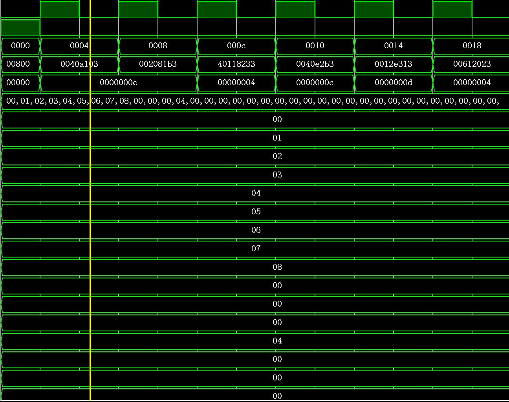

# 23302010034 傅子澈 CPU设计Project

## PJ任务要求

一、项目介绍、要求和提示
	在这个项目中，我们最终需要完成一个能够实现指定RISC-V指令功能的简单单周期CPU的电路设计。附录中，提供了关于这两者的介绍和一个单周期CPU电路设计的实例。当然，我们需要完成的工作比这个实例还要简单得多，因为我们只要求完成的单周期CPU接收并正确处理RISC-V指令的一个很小的子集，同时也减少了对电路中存储设备规模的要求。
对于这个32位单周期CPU电路，我们有一些具体的要求：
	1. 该CPU需要完成的指令有以下9个：
add，sub，or，slt，addi，ori，slti，sw，lw
每条指令长度都为32bits，具体细节参考附件或者说明文档。
	2. 该CPU的部件资源包括：1）X0-X31共32通用寄存器；2）特殊寄存器PC（program counter）和指令暂存寄存器IR（instruction Register）。以上寄存器都是32bits字长。
	3. 存储器包括256bytes的memory（地址为0~255，采用little endian方式存储数据或者指令）。其中地址0~127存放程序指令（最多32条指令），地址128~255存放数据。也可以使用两块128byte的独立存储器；
	4. 最后的波形仿真应当采用功能仿真，且所有存储器件中的数据都应当被显示。
		
设计的正确性，将由功能仿真的结果来检验。一方面，大家应当自行进行功能仿真的测试，并将结果提交；另一方面，我们也会对大家提交的程序进行相关测试。

二、项目提交
	1. 最终提交时间为期末考试之前，提交内容包括：所有基本部件的程序代码（以Project的形式，不能只有.v文件），每条指令的执行仿真波形图（加简要说明），实验报告和文件清单，所有内容应当被打成一个压缩包上传，文件名为“学号+姓名+prj”。

注意事项：
(a) 	CPU设计可以直接使用表达式实现，但是推荐使用经典的多部件组合方式，具体参考附件I。如果使用多个基本部件实现，要对各个部件功能进行说明。
(b) 	实验报告包括但不限于对功能仿真波形图的介绍和说明，以及指令处理的具体过程，以及对CPU所能完成的所有功能和相关性能分析。
(c) 	可以分两阶段实现：第一步指0令0存放0在IR0寄存器，直接对单条命令解析实现所需功能；第二步，若干条指令代码存放在存储器从0x00开始的存储空间，根据PC寄存器的值进行指令读取到IR，再解析执行，同时更新PC寄存器指向下一条指令。
(d) 	实现上面的9条指令后，如果有余力，可以尝试实现beq指令（有额外加分）。
(e) 	在设计文档的内容中包括但不限于CPU的电路示意图、CPU如何实现其功能、怎样通过改进设计提高其性能以及自己在项目中的体会和感受。

三、项目的评分
	项目的基准分为100分，主要包括对以下几项的考核：
1）	指令功能的实现（程序代码）每条5分，共45分；
2）	指令实现设计思路与仿真结果（波形图或者输出结果），共30分；
3）	实验报告及感想体会，共25分；
4）	额外实现beq指令（主要是pc寄存器更新策略），附加分10分。

程序会考察程序的正确、规范等性质；波形图会考察其代表性和体现出的程序性能；文档会考察文档内容是否完整，是否能体现出正确的设计思路，以及是否对单周期CPU的实现进行了自己的思考等。本project对文档有较高的要求，如果有同学能够提出更好的改进意见和建议，请在文档中特别注明，会酌情予以加分。


## 设计的前期准备

### 需求分析

要求支持的指令主要分为三类：算术类、读写以及跳转。在这个基础上，我们规划CPU的基本模块
CPU需要实现的模块包括：

- 程序计数器（PC）管理指令的地址，需要支持跳转和正常递增
- 指令存储器（Instruction Memory）按照PC提供的地址，读取相应的指令，大小为128byte
- 寄存器组（register）32个通用寄存器和一个Instruction register存储正在执行的指令
- 算术逻辑单元（ALU）执行核心的计算，支持算数类的指令
- 数据存储器，存储另外128byte的数据吗，用于支持读写指令 其中地址为128byte，但考虑拓展性，我选择将地址信号拓展到16位
- 指令译码模块（Instruction Decoder）在controller中负责提取指令的字段
- 控制器（Controller）译码读出的指令并将其转化为具体的控制信号
- 最上层的综合所有模块，封装完整的CPU模块
- 单元测试和仿真
  
### 信号接口设计

#### 程序计数器（PC）

- input clk 时钟信号 位宽 1
- input reset 复位信号，用于重置到0 位宽 1
- input pc_update 为1时才允许更新地址 位宽 1
- input next_pc 为beq准备的，若为0，正常更新（地址+4），否则，跳转到对应的地址 位宽 16
- output pc_output 当前需要执行的指令的地址 位宽 16
  
#### 指令存储器（Instruction Memory）和寄存器

- input address 执行指令的地址 位宽 16
- input flag 是否读取 位宽 1
- output instruction 具体的指令 位宽 32

#### 通用寄存器组

- input clk 位宽 1
- input reg_id_1,reg_id_2,reg_d 两个源寄存器的编号 位宽 5
- input operation_type 0代表只读1和2，1代表写1读2，2代表读写1，读2 位宽 2
- input write_data 写入的寄存器的数据 位宽 32
- output reg_data_1,reg_data_2 读出的信号 位宽 32

#### ALU

- input num_1 第一个操作数 位宽 32(4字节)
- input num_2 第二个操作数 位宽 32
- input alu_control 位宽 3
- output result 位宽 32
- output is_zero 是否为0 位宽 1

#### 数据存储器

- input address 访问地址 位宽 16
- input write_data 需要写入的数据，位宽 32
- input read_flag 读取的使能信号 位宽 1
- input write_flag 写入的使能信号 位宽 1
- output data_read 读取的数据 位宽 32

#### 控制器

- input instruction 输入的指令 位宽 32
- output alu_2_type alu第二个操作数是寄存器还是立即数 位宽 2（留冗余）
- output mem_read,mem_write 读写存储器的信号 位宽 1
- output reg_read,reg_write 读写寄存器的信号 位宽 1
- output branch 分支信号 位宽 1
- output alu_op_type alu操作类型信号 位宽 3
- output instruction_type 指令的类型 位宽 3
- output reg1 位宽 5
- output reg2 位宽 5
- output reg3 位宽 5
- output imm 位宽 32

#### 上层的cpu模块

- input clk 时钟信号 位宽 1
- input reset 复位信号 位宽 1
- output result 指令执行的结果，例如算术指令会直接将其赋值位计算得到的结果，读取指令会显示读取的内容，写入和跳转指令会显示0/1，用于仿真时方便追踪
- ...其他信号，视仿真时观察的需求进行增删

### 指令执行流程

#### 算数

- PC更新，给出当前的地址
- 指令存储器取出对应地址指令并放入指令暂存寄存器
- Controller接受指令并更改更新信号
- ALU根据信号，取出对应的数据并进行计算得到结果
- 结果根据控制信号写入新的寄存器
- pc默认更新

#### 读写

- PC更新，给出当前的地址
- 指令存储器取出对应地址指令并放入指令暂存寄存器
- Controller接受指令并更改读写信号
- 数据存储器根据信号进行更新
- pc默认更新
  
#### 跳转

- PC更新，给出当前的地址
- 指令存储器取出对应地址指令并放入指令暂存寄存器
- Controller接受指令，使得branch为1，并根据指令要求设置next_pc
- PC根据信号进行跳转

## 实现流程

### 1.单个模块实现，并对每个模块编写单元测试

#### alu

```verilog
module alu(
    input wire[31:0] num_1,
    input wire[31:0] num_2,
    input wire[2:0] alu_control,
    output reg[31:0] result,
    output wire is_zero
    );

    assign is_zero=(result==32'b0);

    always @(*) begin
        case(alu_control)
            3'b000:begin //add
                result=num_1+num_2;
            end
            3'b001:begin //sub
                result=num_1-num_2;
            end
            3'b010:begin //and
                result=num_1&num_2;
            end
            3'b011:begin //or
                result=num_1 | num_2;
            end
            3'b100:begin //xor
                result=num_1 ^num_2;
            end
            3'b101:begin //slt
               result = (num_1 < num_2) ? 32'b1 : 32'b0; 
            end
            default:begin
                result=32'b0;
            end
        endcase
    end

endmodule
```

该模块根据输入的两个32位数以及控制信号立刻输出结果（组合电路）
其单元测试结果如下


可以看到该模块正确实现了要求的功能

#### data_memory

```verilog
module data_memory(
    input wire clk,
    input wire[15:0] address,
    input wire[31:0] write_data,
    input wire read_flag,
    input wire write_flag,
    output reg[31:0] data_read
      );

    reg [7:0] memory [0:127];

    integer i;
    initial begin

        for (i = 0; i < 128; i = i + 1) begin
            memory[i] = 8'b0;
        end
    end

    always @(*) begin
        if (read_flag) begin
            data_read = {memory[address + 3], memory[address + 2], memory[address + 1], memory[address]};
        end else begin
            data_read = 32'b0;          
        end
    end

    always @(posedge clk) begin
        if(write_flag)begin
            memory[address ] <= write_data[7:0];  
            memory[address + 1] <= write_data[15:8];  
            memory[address + 2] <= write_data[23:16]; 
            memory[address + 3] <= write_data[31:24]; 
        end
    end

endmodule
```

仿真如下

```verilog
initial begin
        
        address = 16'd0;
        write_data = 32'd0;
        read_flag = 1'b0;
        write_flag = 1'b0;

        // Step 1: write
        #10 address = 16'd0; write_data = 32'h11451419; write_flag = 1'b1;
        #10 write_flag = 1'b0; 

        // Step 2: write
        #10 address = 16'd4; write_data = 32'h5A5A5A5A; write_flag = 1'b1;
        #10 write_flag = 1'b0; 

        // Step 3: read data 1
        #10 address = 16'd0; read_flag = 1'b1;
        #10 $display("--------------------------------------------------------");
        #10 $display("Read from Address %d: Data = %h", address, data_read);
        #10 $display("Expected data: h11451419");
        
        #10 read_flag = 1'b0; 

        // Step 4: read data 2
        #10 address = 16'd4; read_flag = 1'b1;
        #10 $display("--------------------------------------------------------");
        #10 $display("Read from Address %d: Data = %h", address, data_read);
        #10 $display("Expected data: 5a5a5a5a");

        #10 read_flag = 1'b0; 

        // Step 5: read from uninitialized
        #10 address = 16'd8; read_flag = 1'b1;
        #10 $display("--------------------------------------------------------");
        #10 $display("Read from Address %d: Data = %h", address, data_read);
        #10 $display("Expected data: undefined");
        #10 $display("--------------------------------------------------------");
        #10 read_flag = 1'b0; 

```


其中可以看到初始的写入均是成功的，读取的数据也符合预期
其中，因为初始化的代码将所有地址初始化为0，所以undefined的地方数据也为0

#### instruction_memory

```verilog
module instruction_memory(
    input wire[15:0] address,
    input wire flag,
    output reg[31:0] instruction
    );

    reg [7:0] memory [0:127];

    integer i;
    initial begin
        
        for (i = 0; i < 128; i = i + 1) begin
            memory[i] = 8'b0;
        end
    end

    always @(*) begin
        if(flag)begin
            instruction = {memory[address+3], memory[address + 2], memory[address + 1], memory[address]};
        end
        else begin
            instruction=32'h0;
        end
    end

endmodule

```
instruction memory使用小端法存储数据，每个instruction为4个字节
instruction memory本身没有支持读写，要求预设好里面的指令，因此测试也只测试其读取功能

```verilog
uut.memory[0] = 8'h78;
uut.memory[1] = 8'h56;
uut.memory[2] = 8'h34;
uut.memory[3] = 8'h12;

uut.memory[4] = 8'hf0;
uut.memory[5] = 8'hde;
uut.memory[6] = 8'hbc;
uut.memory[7] = 8'h9a;

uut.memory[8] = 8'ha9;
uut.memory[9] = 8'hcb;
uut.memory[10] = 8'hed;
uut.memory[11] = 8'h0f;
```

初始化的部分如上，其读取结果如下

符合预期的读取

#### program_counter

```verilog
module program_counter(
    input wire clk,
    input wire reset,
    input wire branch,
    input wire[15:0] next_pc,
    output reg[15:0] pc_output
    );

    wire [15:0] pc_incremented;
    assign pc_incremented = pc_output + 16'd4;

    always @(posedge clk or posedge reset) begin
        if (reset) begin
            pc_output <= 16'b0; // set zero
        end else if (branch) begin //branch
            pc_output <= next_pc; 
        end else begin
            pc_output <= pc_incremented; // default
        end
    end

endmodule
```

pc在正常状态下，每个时钟周期加4，在branch为1的时候，跳转到next_pc指向的位置，在reset为1的时候重置为0

测试如下


符合预期的更新和输出

#### register_group

```verilog
module register_group(
    input wire clk,
    input wire[4:0] reg_id_1,
    input wire[4:0] reg_id_2,
    input wire[4:0] reg_d,
    input wire read,
    input wire write,
    input wire[31:0] data,
    output reg[31:0] reg_data_1,
    output reg[31:0] reg_data_2
    );

    reg [31:0] registers [0:31];

    integer i;
    initial begin
        for (i = 0; i < 32; i = i + 1) begin
            registers[i] = 32'b0;
        end
    end


    always @(*) begin
        if(write) begin
            if(reg_d!=5'b00000)begin
                registers[reg_d]=data;
            end
        end
        reg_data_1 = registers[reg_id_1]; 
        reg_data_2 = registers[reg_id_2]; 
    end

endmodule

```

register同样可以读写，其中，x0不允许写，永久为0
读取和写入使用组合逻辑，读使能在这里没有被使用（但是为了标准性还是保留）
输入信号的reg_1 reg_2 reg_d即对应指令里可能出现的寄存器

仿真如下

仿真结果符合预期

#### controller

```verilog
module controller(
    input wire[31:0] instruction,
    output reg[1:0] alu_2_type,
    output reg mem_read,
    output reg mem_write,
    output reg reg_read,
    output reg reg_write,
    output reg branch,
    output reg[2:0] alu_op_type,
    output reg[2:0] instruction_type,
    output reg[4:0] reg1,          // reg_1
    output reg[4:0] reg2,          // reg_2
    output reg[4:0] reg3,          // rd
    output reg[31:0] imm           // imm from the instruction,or 0 if not included
);

    wire[6:0] op_code = instruction[6:0];
    wire[2:0] funct3 = instruction[14:12];
    wire[6:0] funct7 = instruction[31:25];
    wire[4:0] rd = instruction[11:7];
    wire[4:0] rs1 = instruction[19:15];
    wire[4:0] rs2 = instruction[24:20];


    wire[11:0] imm_i = instruction[31:20]; // I type
    wire[11:0] imm_s = {instruction[31:25], instruction[11:7]}; // S type
    wire[12:0] imm_b = {instruction[31], instruction[7], instruction[30:25], instruction[11:8], 1'b0}; // B type
    wire[19:0] imm_u = instruction[31:12]; // U type
    wire[20:0] imm_j = {instruction[31], instruction[19:12], instruction[20], instruction[30:21], 1'b0}; // J type


    always @(*) begin
        // initialize signals
        alu_2_type = 2'b00;
        mem_read = 0;
        mem_write = 0;
        reg_read = 0;
        reg_write = 0;
        branch = 0;
        alu_op_type = 3'b000;
        reg1 = 5'b00000;
        reg2 = 5'b00000;
        reg3 = 5'b00000;
        imm = 32'b0;

        case(op_code)
            7'b0110011: begin // R type
                alu_2_type = 2'b00; // from register
                reg_read = 1;
                reg_write = 1;
                instruction_type = 3'b000; // R type
                reg1 = rs1;
                reg2 = rs2;
                reg3 = rd; 
                case(funct3)
                    3'b000: alu_op_type = (funct7 == 7'b0100000) ? 3'b001 : 3'b000; // sub or add
                    3'b110: alu_op_type = 3'b011; // or
                    3'b010: alu_op_type = 3'b101; // slt
                endcase
            end
            7'b0010011: begin // I type
                alu_2_type = 2'b01; // from imm
                reg_read = 1;
                reg_write = 1;
                instruction_type = 3'b001; // I type
                reg1 = rs1;
                reg3 = rd; 
                imm = {{20{imm_i[11]}}, imm_i}; 
                case(funct3)
                    3'b000: alu_op_type = 3'b000; // addi
                    3'b110: alu_op_type = 3'b011; // ori
                    3'b010: alu_op_type = 3'b101; // slti
                endcase
            end
            7'b0000011: begin // lw (I type)
                alu_2_type = 2'b01; // imm
                mem_read = 1;
                reg_read = 1;
                reg_write = 1;
                instruction_type = 3'b010; // I type
                reg1 = rs1; 
                reg2 = rs2;
                reg3 = rd; 
                imm = {{20{imm_i[11]}}, imm_i}; 
            end
            7'b0100011: begin // sw S type
                alu_2_type = 2'b01; 
                mem_write = 1;
                reg_read = 1;
                instruction_type = 3'b011; // S type
                reg1 = rs1; 
                reg2 = rs2; 
                imm = {{20{imm_s[11]}}, imm_s}; 
            end
            
            7'b1100011: begin // B type (beq)
                alu_2_type = 2'b01; 
                alu_op_type = 3'b000;
                reg_read = 1;
                branch = 1;
                instruction_type = 3'b100;
                reg1 = rs1;
                reg2 = rs2;
                imm = {{19{imm_b[12]}}, imm_b}; 
            end
            7'b1101111: begin // J type(not used)
                reg_write = 1;
                instruction_type = 3'b101; 
                reg3 = rd; 
                imm = {{11{imm_j[20]}}, imm_j}; 
            end
            7'b0010111: begin // U type(not used in this project)
                reg_write = 1;
                instruction_type = 3'b110; 
                reg3 = rd; 
                imm = {imm_u, 12'b0}; 
            end
            default: begin
                //default values have been set
            end
        endcase
    end
endmodule

```

controller负责解析指令生成控制信号
虽然pj的指令不涉及J、U类型的指令，但是为了完整性依旧预留了位置，并生成了基本的控制信号和立即数
在这里我其实是偷懒了的，将所有可能用到的数据都提前根据位置提取，而在实际上每种提取出来的部分都只适用于一部分指令，对于其他类型指令是未定义的
controller的测试如下(代码略去了display部分)

```verilog
initial begin
// Step 1: R-type
instruction = 32'b0000000_00010_00001_000_00011_0110011; // add x3, x1, x2
#10;


instruction = 32'b0100000_00010_00001_000_00011_0110011; // sub x3, x1, x2
#10;


instruction = 32'b0000000_00010_00001_110_00011_0110011; // or x3, x1, x2
#10;


instruction = 32'b0000000_00010_00001_010_00011_0110011; // slt x3, x1, x2
#10;


// Step 2: I-type
instruction = 32'b000000000001_00001_000_00010_0010011; // addi x2, x1, 1
#10;


instruction = 32'b000000000001_00001_110_00010_0010011; // ori x2, x1, 1
#10;


instruction = 32'b000000000001_00001_010_00010_0010011; // slti x2, x1, 1
#10;


// Step 3: S-type
instruction = 32'b0000000_00010_00001_010_00000_0100011; // sw x2, 0(x1)
#10;


// Step 4: B-type
instruction = 32'b0000000_00010_00001_000_00000_1100011; // beq x2, x1, 0
#10;

$finish;
end
```

结果如下


### 2.顶层模块进行组装

```verilog
module cpu_imp(
    input wire clk,
    input wire reset,
    output wire [15:0] pc_address,      
    output wire [31:0] instruction,     
    output wire [31:0] alu_result       
    );


    reg [15:0] next_pc;
    wire [31:0] reg_data_1, reg_data_2;
    reg [31:0] alu_input_1,alu_input_2;
    wire [1:0] alu_2_type;
    wire mem_read, mem_write, reg_read, reg_write, branch;
    wire [2:0] alu_op_type;
    wire is_zero;
    wire [2:0] instruction_type;
    wire [4:0] reg_1;
    wire [4:0] reg_2;
    wire [4:0] reg_3;
    wire [31:0] imm;
    reg [31:0] data_to_reg3;
    wire [31:0] data_from_mem;

    // ============================
    // Program Counter
    // ============================
    program_counter pc (
        .clk(clk),
        .reset(reset),
        .branch(branch),   // branch signal
        .next_pc(next_pc),
        .pc_output(pc_address)          // the address for next instruction
    );

    // ============================
    // Instruction Memory 
    // ============================
    instruction_memory instruction_memory (
        .address(pc_address),        // current address
        .flag(1'b1),               // always read in this project
        .instruction(instruction)         // target instruction
    );

    // ============================
    // Controller
    // ============================
    controller control_unit (
        .instruction(instruction),
        .alu_2_type(alu_2_type),
        .mem_read(mem_read),
        .mem_write(mem_write),
        .reg_read(reg_read),
        .reg_write(reg_write),
        .branch(branch),
        .alu_op_type(alu_op_type),
        .instruction_type(instruction_type),
        .reg1(reg_1),
        .reg2(reg_2),
        .reg3(reg_3),
        .imm(imm)
    );

    // ============================
    // Register Group
    // ============================
    register_group reg_file (
        .clk(clk),
        .reg_id_1(reg_1),  // rs1
        .reg_id_2(reg_2),  // rs2
        .reg_d(reg_3),
        .read(reg_read), // r/w control
        .write(reg_write),
        .data(data_to_reg3),              // write data
        .reg_data_1(reg_data_1),        // data from reg 1
        .reg_data_2(reg_data_2)         // data from reg 2
    );

    // ============================
    // ALU Input Selection
    // ============================
    always @(*) begin
        case (instruction_type)
            3'b100:begin
                alu_input_1=pc_address;
            end
            default: begin
                alu_input_1=reg_data_1;
            end
        endcase
        
        case (alu_2_type)
            2'b00:begin
                alu_input_2=reg_data_2;
            end
            2'b01:begin
                alu_input_2=imm;
            end
        endcase
    end

    // ============================
    // Reg write selection
    // ============================

    always @(*) begin
        next_pc=0;
        case (instruction_type)
            3'b000: begin //R
            data_to_reg3=alu_result;
            end
            3'b001: begin //I for immediate
            data_to_reg3=alu_result;
            end
            3'b010: begin //I for lw
            data_to_reg3=data_from_mem;
            end
            3'b011: begin //S
            data_to_reg3=32'b0;
            end
            3'b100: begin //B Only beq for this pj
            data_to_reg3=32'b0;
            if(reg_data_1==reg_data_2)begin
                next_pc=alu_result;
            end
            end
            3'b101: begin //J
            data_to_reg3=32'b0;
            end
            3'b110: begin //U NOT REQUIRED FOR THIS PROJECT
            data_to_reg3=32'b0;
            end
            default: begin
            data_to_reg3=32'b0;
            end
        endcase
        
    end

    // ============================
    // ALU
    // ============================
    alu arithmetic_logic_unit (
        .num_1(alu_input_1),
        .num_2(alu_input_2),
        .alu_control(alu_op_type),
        .result(alu_result),
        .is_zero(is_zero)
    );

    // ============================
    // Data Memory
    // ============================
    data_memory data_mem (
        .clk(clk),
        .address(alu_result[15:0]),     // Alu result
        .write_data(reg_data_2),        // reg_2 data
        .read_flag(mem_read),          
        .write_flag(mem_write),        
        .data_read(data_from_mem)                  
    );
endmodule
```

对于单周期cpu，顶层模块主要实现以下功能

- 声明所有顶层的控制和数据信号
- 实例化前述所有模块并连接信号
- 根据控制信号对数据信号进行更新

因为单周期cpu的指令都在一个时钟周期内完成，上述内容都可以直接写为组合逻辑，即assign或always@(*)
代码的命名和注释已经说明了其功能，在这里不全部赘述，只选择一部分说明

- reg写入信号选择：根据指令类型选择是从内存读取的数据写入还是从alu计算结果中写入，同时也预留了其他空间
- alu两个操作数的选择：根据指令决定是从reg、立即数还是其他地方（如pc_address）读入并得到计算结果

所有的信号和读写，除了对memory的读写外，都在一个时钟周期内完成。memory的写直接写为组合逻辑导致了不可预测的结果，因此选择了让他随clk上升沿更新。
每个时钟周期，pc进行默认递增+4或跳转后执行预存的指令，完成cpu要求的功能

### 3.顶层模块的仿真

根据提供的指令，编写了详细的仿真并提供了波形图

```verilog
module tb_cpu_imp;

    reg clk;                       
    reg reset;                   
    wire [15:0] pc_address;        
    wire [31:0] instruction;      
    wire [31:0] alu_result;        


    cpu_imp uut (
        .clk(clk),
        .reset(reset),
        .pc_address(pc_address),
        .instruction(instruction),
        .alu_result(alu_result)
    );

    
    initial begin
        clk = 0;
        forever #10 clk = ~clk; 
    end

    
    initial begin
        
        uut.instruction_memory.memory[0] =8'h93; //addi
        uut.instruction_memory.memory[2] =8'h80; 

        uut.instruction_memory.memory[4] =8'h03; //lw
        uut.instruction_memory.memory[5] =8'ha1; 
        uut.instruction_memory.memory[6] =8'h40; 

        uut.instruction_memory.memory[8] =8'hb3; //add
        uut.instruction_memory.memory[9] =8'h81; 
        uut.instruction_memory.memory[10] =8'h20; 


        uut.instruction_memory.memory[12] =8'h33; 
        uut.instruction_memory.memory[13] =8'h82; //sub
        uut.instruction_memory.memory[14] =8'h11; 
        uut.instruction_memory.memory[15] =8'h40; 

        uut.instruction_memory.memory[16] =8'hb3; 
        uut.instruction_memory.memory[17] =8'he2; //or X5,X1,X4
        uut.instruction_memory.memory[18] =8'h40; 

        // 00000000_01000000_11100010_10110011
        // 00_40_e2_b3

        uut.instruction_memory.memory[20] =8'h13; 
        uut.instruction_memory.memory[21] =8'he3; 
        uut.instruction_memory.memory[22] =8'h12; //ori X6,X5,1

        // 00000000_00010010_11100011_00010011
        //00_12_d3_13

        uut.instruction_memory.memory[24] =8'h23; 
        uut.instruction_memory.memory[25] =8'h20; 
        uut.instruction_memory.memory[26] =8'h61; //sw X6,0(X2)
        // 00000000_01100001_00100000_00100011
        // 00_61_20_23

        uut.instruction_memory.memory[28] =8'hb3; 
        uut.instruction_memory.memory[29] =8'h23;
        uut.instruction_memory.memory[30] =8'h41; // slt X7,X2,X4
        //00000000_01000001_00100011_10110011
        //00_41_23_b3
        

        uut.instruction_memory.memory[32] =8'h13;  
        uut.instruction_memory.memory[33] =8'h24;  //slti X8,X2,8
        uut.instruction_memory.memory[34] =8'h81;  
        // 00000000_10000001_00100100_00010011
        // 00_81_24_13

        uut.instruction_memory.memory[36] =8'he3;  
        uut.instruction_memory.memory[37] =8'h8a;   //beq X3,X5,-12
        uut.instruction_memory.memory[38] =8'h51;   
        uut.instruction_memory.memory[39] =8'hfe;
        

        uut.data_mem.memory[1]=8'h01;
        uut.data_mem.memory[2]=8'h02;
        uut.data_mem.memory[3]=8'h03;
        uut.data_mem.memory[4]=8'h04;
        uut.data_mem.memory[5]=8'h05;
        uut.data_mem.memory[6]=8'h06;
        uut.data_mem.memory[7]=8'h07;
        uut.data_mem.memory[8]=8'h08;
        uut.data_mem.memory[12]=8'h04;


        

    
    end

    initial begin
        #500 $finish;
    end
```

- 上述代码先进行了初始化，将提供的指令以及内存内数据预存入了实例化的cpu模块的instruction_memory和data_memory
- 然后启动了500个时间单位，因为指令是无限循环，以下只介绍一个循环内的变化

#### 演示包含的信号内容

instruction_memory和data_memory按照前述代码初始化

memory为data_memory


在提供的指令里只有sw会修改data_memory，上图说明了在整个指令执行期间memory在sw指令外未被修改

#### 指令1 addi X1, X0, 0x8

寄存器x0恒为0，该指令执行后，x1=8

可以看到寄存器1正确被赋值为8

#### 指令2 lw X2, 4(X1)

从内存地址为12的地方读取，并存入x2,根据预设值，x2=4

寄存器2正确赋值为4

#### 指令3 add X3,X1,X2

x3=x1+x2,x3被赋值12

x3正确赋值为c(12)

#### 指令4 sub X4,X3,X1

x4=x3-x1 结果为x4=4

x4正确赋值为4

#### 指令5 or X5,X1,X4

x5=x4|x1 结果为x5=12


#### 指令6 ori X6,X5,1

x6=x5|0x1 结果为x6=0xd


#### 指令7 sw X6,0(X2)

data_memory在x2地址处值变为x6的值0xd

data_memory[4]后的四个字节被正确赋值为0x0000000d

#### 指令8 slt X7,X2,X4

x2=x4，不符合rs1< rs2，因此，向x7写入0，即x7保持初始值为0不变

无事发生

#### 指令9 slti X8,X2,8

x2=4< 8，因此向x8写入1


#### 指令10 beq X3,X5,-12

因为x3=x5=12,所以pc进行跳转，在下一个周期pc=pc-12而不是pc+4


pc进行跳转，从0x24减少为0x18,即减少了12

#### 之后的循环逻辑


可以看到，指令始终在0x18-0x24间跳转并执行，说明beq指令正确实现

### 4.总结

在这里，正确实现了要求的10种指令，并通过波形图展示了其顺序执行的结果，符合提供的输出预期，该pj的代码部分到此结束

## 遇到的问题

## 感悟

## 实验结论